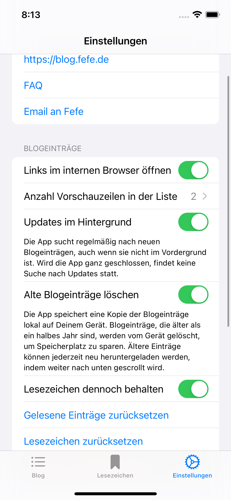

# Fefe Reader  

An iOS app to easier read [Fefes Blog](https://blog.fefe.de).

The app downloads blog entries from that website, parses the content and displays the content in a form appropriate for your iOS device.

The app does not change any content.

## Features

- Read blog entries offline (once downloaded)
- Fast loading
- Marking of read entries
- Notifications for new blog entries
- Possibility to bookmark entries
- Easy sharing of blog entries or linked web sites

## Screenshots

| Main scren | Entry screen | Settings |
| --- | --- | --- |
|  |  |  |

## Disclaimer

This app or the author has no connection to Fefe or his blog. This project is just for learning a few mechanisms in iOS programming - and a bit for the fun.
